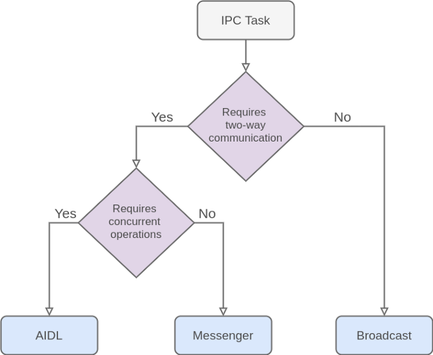
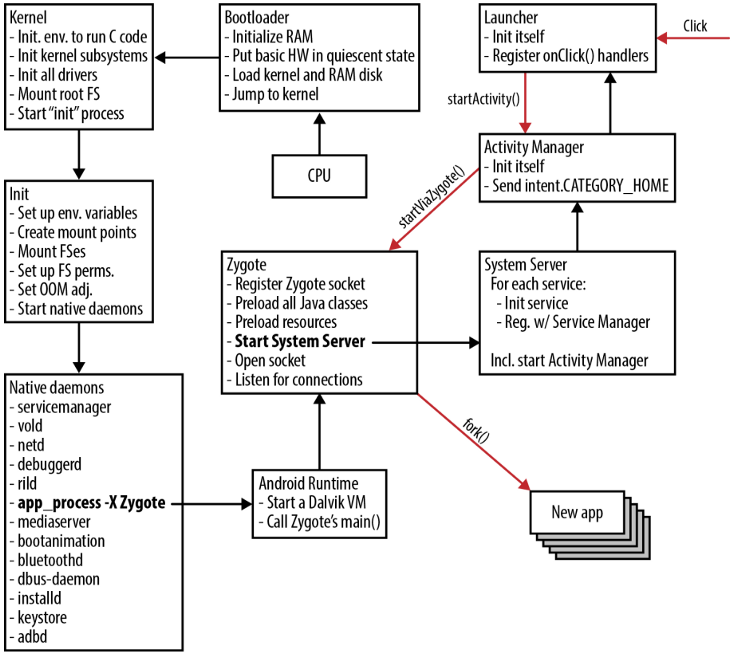

+++
title = "Setting up debugging on Android"
date = "2021-06-01"
+++

I've been meaning to learn some android exploitation for quite sometime now. In this post , I propose to document the method of setting up a proper debugging environment (for self reference too) to debug android applications with the good old GDB.

## A short insight into the Android system

One might consider android to be an open source linux based system , although it's not completely true , android does have the linux kernel layer in it. The only similarity between android and linux is that they share a similar kernel but apart from that , everything else is mostly different. In linux on one hand , you can directly get root access with the `sudo` command , but that isn't the case (unless you've rooted your phone) on android. With root access to an android phone , you can
basically access it's internal linux kernel layer and make modifications at the very heart of android , thus making it even more exciting to get your phone rooted. I have mentioned that android and linux share all their similarities in their kernel , which means they also have their differences.

## Linux Kernel vs Android Kernel

There are quite a few functionalities which have been added to linux kernel to make it adept to be used as the android kernel.

### IPC Binder

Some apps attempt to implement IPC using traditional Linux techniques such as network sockets and shared files. However, now most apps use Android system functionality for IPC such as Intent, Binder or Messenger with a Service, and BroadcastReceiver. The Android IPC mechanisms allow you to verify the identity of the application connecting to your IPC and set security policy for each IPC mechanism.

There are 3 basic methods used for IPC on Android:
1. AIDL
2. Messenger
3. Broadcast

When do you know what to use?



## ASHMEM (Android Shared Memory)

+ Ashmem is an Anonymous Shared Memory system that adds interfaces so processes can share named blocks of memory. As an example, the system could use Ashmem to store icons, which multiple processes could then access when drawing their UI.

+ The advantage of Ashmem over traditional Linux shared memory is that it provides a means for the kernel to reclaim these shared memory blocks if they are not currently in use.

+ If a process then tries to access a shared memory block the kernel has freed, it will receive an error, and will then need to reallocate the block and reload the data.

## Process Memory Allocator (PMEM)

This is used to manage large physically contiguous regions of memory shared between userspace and kernel drivers.

## Ashmem vs Pmem

+ Ashmem uses virtual memory whereas Pmem uses physically contiguous memory.
+ With Ashmem, we have `reference counted` objects that can be shared between multiple processes.
+ Pmem doesnt work that way because it needs to maintain physical to virtual mapping. This requires the process which allocates a pmem heap to hold the FD until all other references are dropped.

## Android Boot Process

These are the steps in which Android Booting happens:

1. `Bootrom` , the write-protected flash rom which is embedded inside the processor's chip runs the very first code when an android phone is powered up.
2. `Bootloader` is started by `Bootrom` which executes all boot specific setup ie, copies OS related programs into the main memory before firing up the kernel.
3. `Kernel` starts up scheduling and loading drivers, setup cache , mounts all file systems, and finally executes something called `init` which is essentially the first process.
4. `init` is the initial process which does things like mounting important directories like `/sys` , `/dev` and `/proc` and finally runs the `init.rc` script.
5. The `init.rc` is responsible for starting up important native daemons like the  `Zygote process` ,`Service Manager`, `Media Server` etc.
6. `Android Runtime` is started by the `init` process with `app_process` command which tells it to start the process virtual machine - `Art` or `Dalvik` and finally call the `zygote` processes' main function.



## A little more about Zygote Process

`Zygote` is a special android process that enables shared code across process VM in contrast to Java VM where each instance has it's own copy of all shared library class files and heap objects.

Zygote preloads all classes and resources which an app may potentially need at runtime into system's memory when it first starts. This technique speeds up loading of apps. After loading all app related stuff,  zygote listens for connections on it's socket for requests of any new app starts. When a new app requests to start , zygote forks itself and launches the app. The `zygote` process serves as the `parent` to all android apps.

Zygote gets its forking feature from the Linux kernel implementation of `copy-on-write` technique. All processes starting from zygote use it's own copy. It doesnt actually copy anything , instead it maps pages of new process over those of the parent process and makes copies only when a new process writes on that page.

`System Server` is the first process started by `Zygote`. After starting , it lives on as a separate process from it's parent. It starts initializing all system services. 

## Pre-requisites

+ Download and install latest version of Android Studio by following this wonderful [blog](https://linuxize.com/post/how-to-install-android-studio-on-ubuntu-18-04/).

+ For basic creating android virtual emulator , follow this [blog](https://developer.android.com/studio/run/managing-avds).

Now that everything is ready and set , let's get to some business.

## Making system writeable

To run `gdbserver` on our device , we need to first make the `/system` folder writeable, by default , it is read-only.

By default , even if we run `adb` as root , a couple of times , while trying to mount `/system` as writeable we're hit with the `/system not in /proc/mounts` as the `/system` partition is made `read only` in the very booting up of the emulator itself.

To fix that ,we fire up the emulator with `-writable system` flag , and then we can remount system as writeable with adb root.

To view list of active devices , run

```sh
adb-devices
```

The output should look something like this since we have just one device connected.

```sh
List of devices attached
emulator-5554	device
```

You can simply get into the device with 

```sh
abd -s emulator-5554 shell
```

Note that `emulator-5554` is to be replaced with the name of the device we wish to connect to.

To get a list of all active emulators , navigate to the `/path/to/Android/Sdk/` and run - 

```sh
~/Android/Sdk/tools ❯ ./emulator -list-avds

Cyb0rG
Pixel_3a_API_30_x86

```

The output should be something similar.

Now , to fire up our emulator with writeable system , run

```sh
./emulator -avd Cyb0rG -writable-system
```

Again , `Cyb0rG` should be replaced with the name of the desired avd.

After that,  we run adb as root and remount it because it is by default mounted as `read-only` even if `-writable-system` is used.

```sh
adb root
adb remount
adb -s emulator-5554 shell
```

Finally, inside the device , mount the `/system` as read-write.

```sh
mount -o rw,remount /system
mount -o rw,remount /
```

## Setting up the gdbserver

Verify the architecture of your connected device with `uname -m` inside the adb shell.

Navigate to the `ndk` folder which should ideally be located in the `Sdk` folder itself. Once there , you will find a `prebuilt` folder in which we find `gdbserver` for various architectures.

Since I'm running the emulator on x86 , this is the path to gdbserver in my machine.

```sh
~/Android/Sdk/ndk/22.1.7171670/prebuilt/android-x86_64/gdbserver
```

Once here, we push `gdbserver` into our device with `adb push gdbserver /system/bin`.

Now that we have pushed `gdbserver` , we can easily attach to any process by it's process id. We get the `pid` of a process with `ps aux | grep <process_name>`.

```sh
gdbserver :8888 --attach 2741
```

Replace `2741` with the `pid` of the process you wish to debug.

After that , we port forward from adb shell to our host machine so that we can debug from the comforts of our local machine.

```
adb forward tcp:8888 tcp:8888
```

Now, all that is left is to fire up gdb , and run `target remote :8888`.

## Conclusion

That's all there is to setup gdb to debug native android applications.
